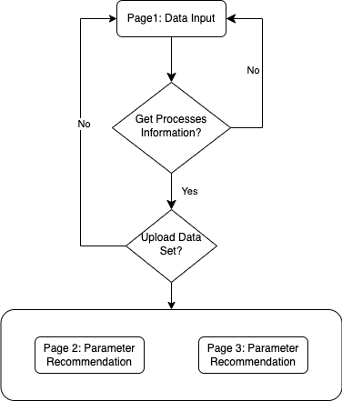

# Introduction

This is a Demo for the project "Intelligent Manufacturing-oriented Big Data Analytics across the Production Process: Methodologies and Applications"

It allows users to upload dataset for a control parameter recommendation algorithm and a self-adapting trajectory redress algorithm and then demonstrate the result of them.

# Getting Start

It's a project with both front end and back end, meaning that we have to use two process serving as front-end server and back-end server.

To start the Front-end service, please go to the `/Front-End/` folder.

1. run `npm i`
2. run `npm run dev`

To start the Back-end service, please go to the `/Back-End/` folder.

1. run `pip install -r requirements.txt`
2. run `python api.py`

## Software version

- Python 3.9.15
- npm 8.19.2
- node 18.12.1

# Usage

There are three pages.


The first page allows you to upload your dataset, and then assign them to the corresponding industrial process. Before stepping to the next page, you have to confirm that you have assigned the correct data file to the corresponding process.


The second page demonstrates a control parameter recommendation system of a laser welding process. On the left, you will see a list of numerical input boxes, which allow you to adjust the parameters as you like, click the button below will fill the boxes with our recommended parameter automatically. On the right is the illustration of the physical meaning of the parameter you are now focusing on.

To clarify that we recommend optimum parameter combination, some industrial indicators are showing on the top, making it easier to the comparison between ours and the one you adjected.


The final page demonstrates a trajectory self-adapting redress algorithm based on an ultra-precise diamond-cutting process. In the graph, the original command position, the redressed command position, and the following error will be depicted as a line graph. There are two types of trajectories to choose from, showing that our algorithm could tackle multiple situation.

# Features

1. Draggable way to input datasets to their corresponding industrial process.
2. Big data-driven Control parameter recommendation algorithm on the laser welding process.
3. Big data-driven Trajectory self-adapting redress algorithm on cutter movement control of the ultra-precision diamond cutting process.

# Development

The demo consists of two part: Front-End and Back-End.

## Front-End

Using vite + vue3 + typescript + element-ui + draggable as the project based.

### Project Structure

```bash
.
├── README.md
├── auto-imports.d.ts
├── components.d.ts
├── index.html
├── node_modules
├── package-lock.json
├── package.json
├── public
├── src
│   ├── App.vue
│   ├── assets
│   ├── components
│   │   ├── Draggable
│   │   ├── Echarts
│   │   ├── Form
│   │   ├── Header
│   │   ├── Upload
│   │   └── store
│   ├── main.ts
│   ├── page
│   │   ├── Page1.vue
│   │   ├── Page2.vue
│   │   └── Page3.vue
│   ├── types
│   ├── utilies
│   ├── router
│   ├── api
│   └── vite-env.d.ts
├── tsconfig.json
├── tsconfig.node.json
└── vite.config.ts
```

### Router



### API

- Upload:
  - Url: '/api/upload'
  - Method: POST
  - Send: File
  - Receive: Json
    Front end use this api to upload the data file to the back end server. Back end server will decompress the file and then go through all available data files before return the list of them.

- getProcesses:
  - Url: '/api/getprocesses'
  - Method: GET
  - Send: None
  - Receive: Json  
    Front end use this api to get the info of processes available on the back end. Normally it should contain the name of the process and the parameters it required.

- getRecommend:
  - Url: '/api/getRecommend'
  - Method: GET
  - Send: String
  - Receive: Json
    Front end use this api to get the result of parameter recommendation from the back end. Front end will send the path of data file to the back end, then back end will return the result in json form.

- selfAdapting:
  - Url: '/api/selfAdapting'
  - Method: GET
  - Send: String
  - Receive: Json
    Front end use this api to get the result of trajectory self-adapting redressment. Front end should tell the back end server the path of the data file, then back end shall return the a list of results in json form.

### Draggable Data Input

Please refer to the codes in `/src/components/Draggable`

### Echarts

Please refer to the codes in `/src/components/Echarts`

## Back-End

Using Python + Flask as the back-end server.

Using sk-learn to implement the two algorithms.

### Config

Config files was placed in `config`

### Control Parameter Recommendation

#### Background

Laser beam welding (LBW) is a welding technique used to join pieces of metal or thermoplastics through the use of a laser. The beam provides a concentrated heat source, allowing for narrow, deep welds and high welding rates. The process is frequently used in high volume and precision requiring applications using automation, as in the automotive and aeronautics industries. It is based on keyhole or penetration mode welding.

Since laser beam welding has high power density (on the order of 1 MW/cm2) resulting in small heat-affected zones and high heating and cooling rates, in some control parameter settings, some cracks would occur on the metal, making it a defective product.

Apart from the cracks, some of the parameters have some physical attributes, making it worth optimizing, in order to make the industrial process cost-effictive, fast, and flawless.

Considering all the above, we want to proposed a control parameter recommendation algorithm, that could recommend the optimial parameter settings, while making sure that no cracks would occurred on the metal.

**Given**:

- The parameter settings $\{ P_i \}_{i=1}^{N}$ where $N$ denotes the number of parameter combinations, and $P_i = (p_1, p_2, \ldots, p_k)$ where $k$ denotes the number of categories of paramters.

- Label set $\{y_i\}_{i=1}^{N}$ where $y_i = [0,1]$ and $0$ denotes there is a crack after welding while $1$ denotes there isn't a crack after welding.

- A set of parameters that should maximize $\{p_{j}\}_{j \in K_1}$, a set of parameters that should minimize $\{p_{j}\}_{j \in K_2}$, and a set of parameters that are no optimization goal $\{p_{j}\}_{j \in K_3}$ where $K_1 \cup K_2 \cup K_3 = K$ and $K_i \cap K_j = \phi, (i \neq j)$

**Objective**

- Output a combination of $(p^{j})_{j=1}^{k}$ that after welding, there wouldn't be any cracks on the metal while meeting all optimization goals.

#### Method

There are six kinds of paramter provided by the data set, that is:

|           Name           | DataType  |    Range     | Step  |
|:-----------------------: |:--------: |:-----------: |:----: |
|        power (W)         |   int64   | [900, 1200]  |   1   |
|  welding speed (m/min)   |  float64  |  [0.8, 1.2]  |  0.1  |
|  gas flow rate (l/min)   |   int64   |   [10, 20]   |   1   |
|   focal position (mm)    |   int64   |   [-2, 2]    |   1   |
|   angular position (°)   |   int64   |  [-15, 15]   |   1   |
| material thickness (mm)  |  float64  |  [0.5, 0.7]  |  0.1  |

And the result is whether there will be a crack in the welding metal afterward.

According to domain knowledge, we assume $K_1 = \{\text{welding speed (m/min)}\}$, $K_2 = \{\text{power (W), gas flow rate (l/min)}\}$, and $K_3 = \{\text{focal position (mm), angular position (°), material thickness (mm)}\}$

1. We use a LogisticRegression model provided by sk-learn to learn a mapping $f(P) \rightarrow \hat y$.
2. We enumerate all possible combination of parameters $\{P\}_{\text{all}}$, and apply the mapping $f$ on them, from which we select those with $\hat y=1$ as the alternative set $\{P\}_{\text{alt}}$.
3. Finally, we utilize Immune Genetic Algorithm to select the optimal combination $P_{\text{opt}}$ from $\{P\}_{\text{alt}}$ by simultaneously meet all optimization objective.

For implementation details please refer to the codes in `laser_welding.py`.

---

### Self-Adapting Trajectory Redressment

#### Background
